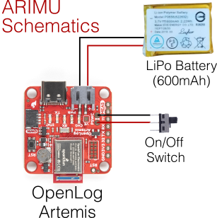
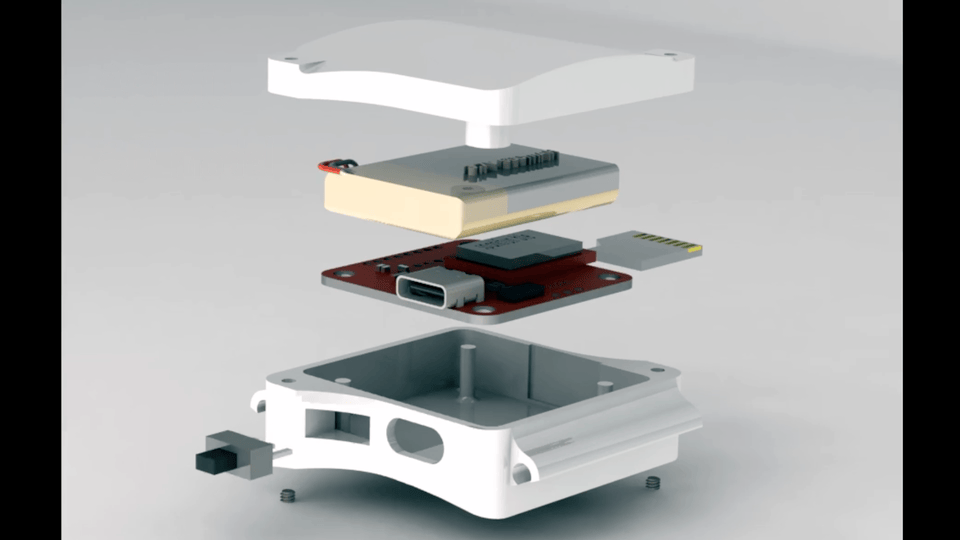
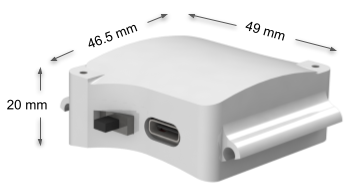

# ARm use IMU FIrmwaRE - ARIMUFire

ARIMU or _Arm use IMU_ is a wearable movement sensor developed by the [Biological Learning and Rehabilitation Group](http://biorehab.github.io) at the Department of Bioengineering, Christian Medical College Vellore, India. It is based on the versatile, open-source data logger [OpenLog Artemis](https://www.sparkfun.com/products/16832) from SparkFun.

We first describe the device ARIMU, and then provide the details of the current version of the firmware.

## ARIMU 
Arm Use IMU is essentially the OpenLog Artemis with custom firmware and enclosure. The current version of the device uses only the onboard IMU sensor, RTC, and microSD card logging modules. ARIMU's schematic is shown in the following figure.

  

The current version of ARIMU uses a 600mAh Lithium Polymer battery. The OpenLog board, the battery, and the switch are placed in a 3D-printed enclosure with holders for straps. The 3D model of the enclosure, its dimensions, and the arrangement of the different components inside the enclosure are shown below.

  
  

The 3D model file for the ARIMU enclosure and its components can be found [here](3d_files).

Here is a video of the physical prototype of a fully assembled ARIMU with the straps for donning it around the wrist.

## ARIMUFire 

ARIMU does not use the native firmware that comes with the OpenLog. This was done for three reasons:
1. To allow the OpenLog to operate in logging or data streaming (via USB serial, BLE or any other wireless protocol through add-on hardware) modes. 
2. To be able to read and set custom device parameters through USB serial.
3. To be able to read and manage files on the SD card through USB serial.

The custom firmware - ARIMUFire - is implemented to allow for all these features and a few more. 

### Device parameters
There are several device parameters that are used in the current firmware.
- **Device name**: A name can be assigned to individual devices.
- **Subject name**: The user to which the device can be assigned; this can be read and set through a USB serial protocol.
- **Max. size of a file**: There is a maximum size limit for individual files logged onto the SD card. If the size of the current file exceeds this, the device creates a new file.
- **Date time threshold**: A threshold for the datetime is set, and whenever the RTC value goes below this, the device will set an error flag to indicate that the RTC is out of sync.

### Data logging 
At every loop execution, ARIMUFire logs the RTC timestamp, the three values of the accelerometer, and the three values of the gyroscope. The data is logged in a binary format, which has a header, and the data packets with timestamps, accelerometer, and gyroscope values. Each data packet is 19 bytes long as shown below:
<table>
<thead>
  <tr>
    <th style="font-size: 10px" colspan="7">Timestamp (7 bytes)</th>
    <th style="font-size: 10px" colspan="3">Accelerometer (6 bytes)</th>
    <th style="font-size: 10px" colspan="3">Gyroscope (6 bytes)</th>
  </tr>
</thead>
<tbody>
  <tr bgcolor="#EEEEEE">
    <td style="font-size: 10px" align="center">Year</td>
    <td style="font-size: 10px" align="center">Month</td>
    <td style="font-size: 10px" align="center">Day</td>
    <td style="font-size: 10px" align="center">Hour</td>
    <td style="font-size: 10px" align="center">Minute</td>
    <td style="font-size: 10px" align="center">Second</td>
    <td style="font-size: 10px" align="center">10milsec</td>
    <td style="font-size: 10px" align="center">ax</td>
    <td style="font-size: 10px" align="center">ay</td>
    <td style="font-size: 10px" align="center">az</td>
    <td style="font-size: 10px" align="center">gx</td>
    <td style="font-size: 10px" align="center">gy</td>
    <td style="font-size: 10px" align="center">gz</td>
  </tr>
  <tr>
    <td style="font-size: 10px" align="center">1 byte</td>
    <td style="font-size: 10px" align="center">1 byte</td>
    <td style="font-size: 10px" align="center">1 byte</td>
    <td style="font-size: 10px" align="center">1 byte</td>
    <td style="font-size: 10px" align="center">1 byte</td>
    <td style="font-size: 10px" align="center">1 byte</td>
    <td style="font-size: 10px" align="center">1 byte</td>
    <td style="font-size: 10px" align="center">2 bytes</td>
    <td style="font-size: 10px" align="center">2 bytes</td>
    <td style="font-size: 10px" align="center">2 bytes</td>
    <td style="font-size: 10px" align="center">2 bytes</td>
    <td style="font-size: 10px" align="center">2 bytes</td>
    <td style="font-size: 10px" align="center">2 bytes</td>
  </tr>
</tbody>
</table>

The individual data filenames have the following format: "{Subject name}\_data\_{File number}.bin"

### Device LEDs
There is a red and blue LED on the OpenLog which are used to indicate the mode of operation of the ARIMU:
<table>
<thead>
  <tr bgcolor="#EEEEEE">
    <th style="font-size: 10px" align="center">Mode</th>
    <th style="font-size: 10px" align="center">Red LED</th>
    <th style="font-size: 10px" align="center">Blue LED</th>
  </tr>
</thead>
<tbody>
  <tr>
    <td style="font-size: 10px" align="center">RTC error/SD card error</td>
    <td style="font-size: 10px" align="center">Fast blinking</td>
    <td style="font-size: 10px" align="center">Fast blinking</td>
  </tr>
  <tr>
    <td style="font-size: 10px" align="center">Normal SD logging</td>
    <td style="font-size: 10px" align="center">Off</td>
    <td style="font-size: 10px" align="center">Blinks every 5 sec</td>
  </tr>
  <tr>
    <td style="font-size: 10px" align="center">Data communication (via USB serial)</td>
    <td style="font-size: 10px" align="center">On</td>
    <td style="font-size: 10px" align="center">On</td>
  </tr>
</tbody>
</table>
